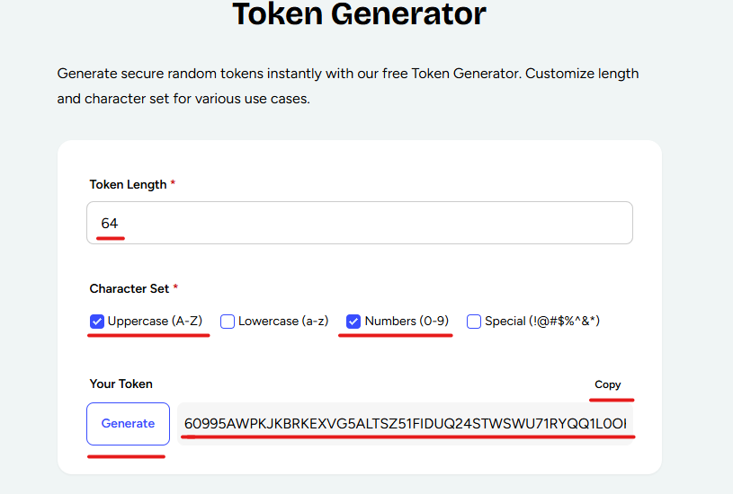
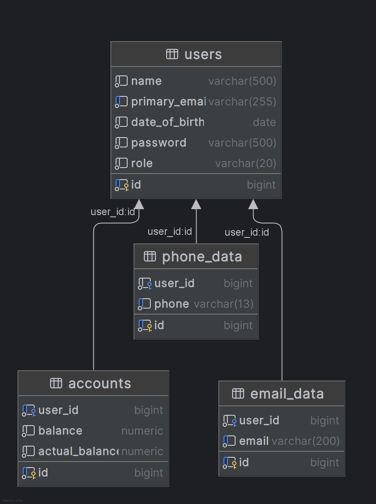

# Демо проект с минимальным набором технологий, ввиду не коммерческого производства!

# Полноценное веб-приложение REST написано с использованием следующих технологий:

- Maven
- Hibernate
- JPA
- PostgresSQL
- Spring Boot
- Spring security
- Docker container
- Liquibase migration db

### Краткое описание проекта

- Автономное приложение, предоставляющее REST API

### Предварительные условия:

- Java 21
- PostgresSQL

# Запуск приложения с помощью Docker

Эта инструкция поможет вам запустить приложение в контейнере Docker.

## Предварительные требования

1. **Docker**: Убедитесь, что Docker установлен на вашем компьютере. Вы можете скачать и установить его
   с [официального сайта Docker](https://www.docker.com/get-started).

## Запуск приложения

Чтобы запустить приложение с помощью docker-compose, необходимо клонировать проект к себе на компьютер, после чего
создать в корне проекта файл `.env`, заполнить необходимые поля `**************`

[Генерация секретного JWT ключа](https://openreplay.com/tools/token-generator/): длина ключа `64`

<a href="materials/TokenImage.png">
    
</a>

```.dotenv
SPRING_PROFILES_ACTIVE=dev
SERVER_PORT=8080

JWT_SECRET_KEY=**************

POSTGRES_DB=**************
POSTGRES_USER=**************
POSTGRES_PASSWORD=**************

POSTGRES_DB_URL=jdbc:postgresql://db/${POSTGRES_DB}
POSTGRES_DB_USERNAME=${POSTGRES_USER}
POSTGRES_DB_PASSWORD=${POSTGRES_PASSWORD}
```

## Шаги для запуска приложения

### 1. Запуск приложения с помощью Docker Compose

После вышеуказанных действий прописанных в инструкции, в директории, где находятся файлы прописать команду:

```bash
docker compose up
```

## Установка и настройка

### Пользователь-администратор

В процессе миграции базы данных были добавлены тестовый пользователи, у всех пароль ```user```, а также создан
пользователь
с правами администратора. Вы можете использовать следующие учетные данные для входа в систему:

- **Логин:** `alice@example.com`
- **Пароль:** `user`

###

- **Логин:** `admin@gmail.com`
- **Пароль:** `admin`

### Как проверить

1. Убедитесь, что база данных была успешно мигрирована.
2. Запустите ваше приложение.
3. Перейдите на страницу входа и введите указанные учетные данные.

### Примечание

- Эта учетная запись предназначена только для тестирования. Рекомендуется изменить пароль и настройки учетной записи
  после первого входа в систему.

### После запуска приложения, можно запустить ```Swagger```

[](http://localhost:8080/swagger-ui/index.html)

### Мои запросы к приложению в Postman

[](https://documenter.getpostman.com/view/21948648/2sB2izEtGm)

# Модель данных

## Диаграмма ER для модели данных

<a href="materials/db_diagram.png">
    
</a>

## RESTful API

**1. Описание API общих методов для аутентификации**

| METHOD | PATH          | DESCRIPTION              |
|--------|---------------|--------------------------|
| POST   | /auth/sign-up | Регистрация пользователя |
| POST   | /auth/sign-in | Авторизация пользователя |

###

**2. Описание API общих методов для управления аккаунтами**

| METHOD | PATH                      | DESCRIPTION                         |
|--------|---------------------------|-------------------------------------|
| POST   | /api/v1/accounts/transfer | Перевод между счетами пользователей |
| GET    | /api/v1/accounts/{userId} | Получить аккаунт по ID пользователя |

###

**3. Описание API общих методов для управления пользователями**

| METHOD | PATH                                          | DESCRIPTION                                |
|--------|-----------------------------------------------|--------------------------------------------|
| POST   | /api/v1/users/add-phone                       | Добавить телефон пользователю              |
| POST   | /api/v1/users/add-email                       | Добавить email пользователю                |
| PATCH  | /api/v1/users/update-phone                    | Обновить телефон пользователя              |
| PATCH  | /api/v1/users/update-email                    | Обновить электронную почту пользователя    |
| GET    | /api/v1/users/{userId}                        | Получить пользователя по ID                |
| GET    | /api/v1/users/show-phones/{userId}            | Получить все номера телефонов пользователя |
| GET    | /api/v1/users/show-emails/{userId}            | Получить все emails пользователя           |
| GET    | /api/v1/users/show-all                        | Получить всех пользователей                |
| GET    | /api/v1/users/search                          | Поиск пользователей                        |
| DELETE | /api/v1/users/{userId}/delete-phone/{phoneId} | Удалить номер телефона пользователя по ID  |
| DELETE | /api/v1/users/{userId}/delete-email/{emailId} | Удалить email пользователя по ID           |

